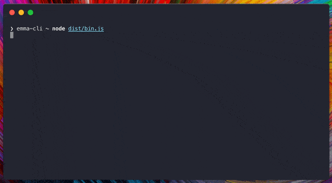

<p align="center"></p>

# Emma 📦

[](https://circleci.com/gh/maticzav/emma-cli)
[](https://badge.fury.io/js/emma-cli)

[](#backers) [](#sponsors)

> Install the package you are looking for.

Powered by [Algolia search API](https://www.algolia.com/).

<p align="center"></p>

## Overview

Emma is a command line assistant which helps you search and install packages more efficiently from your CLI.

## Features

- 🔍**Peek definitions:** Use right arrow keys to get description of the packages or peek README.
- ⏳**Scroll infinitely:** Search all the packages from NPM and Yarn using your terminal.
- 📚**Build the stack:** Search for multiple packages and install them with one keystroke.

## Install

```bash
npx emma-cli
```

or

```bash
yarn global add emma-cli
```

> Exposes two global commands, `ema` and `emma`.

## Example

```
❯ emma-cli ~ emma
Search packages on Yarn: @types/rea
◉ 16.6m  @types/react                  DefinitelyTyped
  7.3m   @types/react-dom              DefinitelyTyped
  4m     @types/react-router           DefinitelyTyped
  3.9m   @types/react-transition-group DefinitelyTyped
  2.8m   @types/react-router-dom       DefinitelyTyped
Overview
dependencies
 - react
 - react-dom
devDependencies
 - @types/react
Installation
Successfully installed dependendencies!
Search powered by Algolia.
```

## API

```
Usage
  $ emma

Controls:
  - space: toggle dependencies
  - up/down: scroll the list
  - right/left: hide or show details
  - double right: show repo
```

> All flags after `emma` are forwarded to installer.

## Contributors

This project exists thanks to all the people who contribute.
<a href="graphs/contributors"></a>

## Backers

Thank you to all our backers! 🙏 [[Become a backer](https://opencollective.com/emma-cli#backer)]

<a href="https://opencollective.com/emma-cli#backers" target="_blank"></a>

## Sponsors

Support this project by becoming a sponsor. Your logo will show up here with a link to your website. [[Become a sponsor](https://opencollective.com/emma-cli#sponsor)]

<a href="https://opencollective.com/emma-cli/sponsor/0/website" target="_blank"></a>
<a href="https://opencollective.com/emma-cli/sponsor/1/website" target="_blank"></a>
<a href="https://opencollective.com/emma-cli/sponsor/2/website" target="_blank"></a>
<a href="https://opencollective.com/emma-cli/sponsor/3/website" target="_blank"></a>
<a href="https://opencollective.com/emma-cli/sponsor/4/website" target="_blank"></a>
<a href="https://opencollective.com/emma-cli/sponsor/5/website" target="_blank"></a>
<a href="https://opencollective.com/emma-cli/sponsor/6/website" target="_blank"></a>
<a href="https://opencollective.com/emma-cli/sponsor/7/website" target="_blank"></a>
<a href="https://opencollective.com/emma-cli/sponsor/8/website" target="_blank"></a>
<a href="https://opencollective.com/emma-cli/sponsor/9/website" target="_blank"></a>

## License

MIT © [Matic Zavadlal](https://github.com/maticzav)

<p align="center"><a href="https://www.algolia.com"></a></p>
