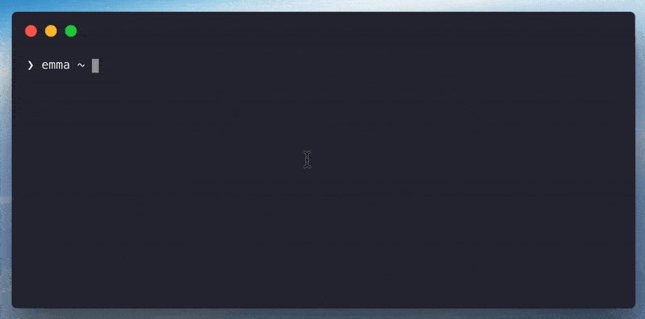

<p align="center"></p>

# Emma 📦

[](https://circleci.com/gh/maticzav/emma-cli)
[](https://badge.fury.io/js/emma-cli)
[](https://github.com/xojs/xo)

> Install the package you are looking for.

Power by Algolia and Yarn.

<p align="center"></p>

## Overview

Emma is a command line assistant which helps you search and install packages more quickly. Using the power of Algolia it is extremely responsive and gives you all the information you need to decide which package is the right one.

## Features

- __Extremely fast:__ Search all the packages from NPM and Yarn using your terminal.
- __Build the stack:__ Search for multiple packages and install them with one keystroke.
- __Automatic tool detection:__ Detects whether it should use Yarn or NPM, out of the box.

## Install

```bash
npm install -g emma-cli
```

Use Yarn or NPM to install.

## Example

```bash
❯ emma-cli ~ emma
Search packages 📦  : graphql
❯ 2m     graphql          graphql         A Query Language and Runtime which can target any service.
  176    graph.ql         MatthewMueller  Faster and simpler technique for creating and querying Grap
  971.6k @types/graphql   DefinitelyTyped TypeScript definitions for graphql
  950.5k graphql-tag      apollostack     A JavaScript template literal tag that parses GraphQL queri
  790.2k graphql-anywhere apollographql   Run GraphQL queries with no schema and just one resolver

Picked:
› ava  0.25.0
```

## API

```md
Usage
   $ emma

Example
   $ emma -D

Options
   --dev -D      Add to dev dependencies.

Run without package-name to enter live search.
Use keyboard to search through package library.
Use up/down to select packages.
Click enter to trigger the install.
```

## License

MIT © [Matic Zavadlal](https://github.com/maticzav)

<p align="center"></p>
